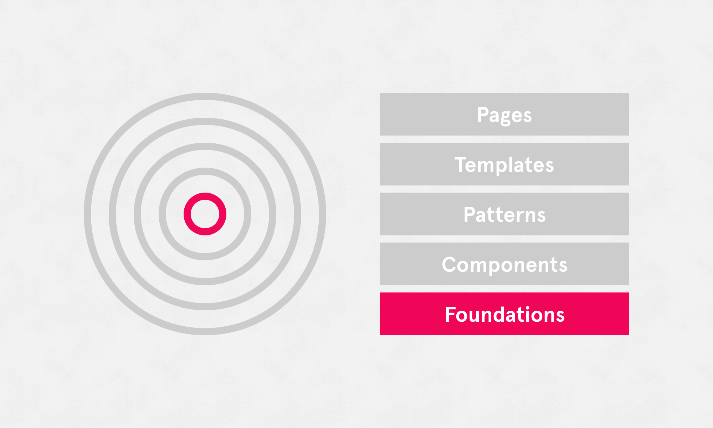

# Foundations

Foundations are essentially 'digital brand guidelines' for the products using this design system. They are styles and guidelines that touch all 'components' and 'patterns', forming the foundations of a product's UI. Examples include color, text styles, links, icons, and even spacing.

#### Skip to:

* [Colours ↗](https://sse-digital.gitbook.io/ui-styleguide/~/edit/primary/foundations)
* Buttons ↗
* Typography ↗

