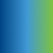

# Colours

## Use of colours

These colours form the core palette for all SSE digital products. Where appropriate, examples of usage are given but these are not absolute – refer to any supplied Sketch files or Zeplin links for specific usage.


Colours are referred to throughout these digital guidelines using their **variable name **shown in the colour tables below.


## Primary colours

SSE's primary brand colors are used in all digital products. **These colours are **[**WCAG 2.0 AA compliant**](https://www.w3.org/TR/WCAG20/#visual-audio-contrast)** when contrasted with white.**

| **Colour** | **Variable name** | **Example usage** | **Hex code** |
| --- | --- | --- |
|  | $primaryBlue | Headings, labels, titles | `#004687` |
|  | $primaryGreen | Icons, bullet points, highlights | `#469638` |

## Secondary colours

These colours complement the primary palette and are used to convey meaning. **Not all secondary colours will be **[**WCAG 2.0 AA compliant**](https://www.w3.org/TR/WCAG20/#visual-audio-contrast)** when contrasted with white**.

| **Colour** | **Variable name** | **Example usage** | **Hex code** |
| --- | --- | --- | --- | --- | --- | --- | --- | --- |
|  | $secondaryBlue | Calls to action | `#004687` |
|  | $secondaryLightBlue | Illustrations | `#A0C6E9` |
|  | $secondaryGreen | Illustrations | `#004B1C` |
|  | $secondaryLightGreen | Illustrations | `#B2D235` |
|  | $secondaryDarkGrey | Text | `#212121` |
|  | $secondaryMidGrey | Text | `#616161` |
|  | $secondaryGrey | Linework | `#BDBDBD` |
|  | $secondaryLightGrey | Backgrounds, content sections | `#F5F5F5` |

## Alert colours

Used to convey soft or hard alert or error messages. **These colours are **[**WCAG 2.0 AA compliant**](https://www.w3.org/TR/WCAG20/#visual-audio-contrast)** when contrasted with white.**

| **Colour** | **Variable name** | **Example usage** | **Hex code** |
| --- | --- | --- |
|  | $alertOrange | Soft warnings | `#FFB100` |
|  | $alertRed | Hard warnings or errors | `#E62128` |

## Gradients

Gradients should only be used as decorative elements. **Do not place text over gradients.**

| **Gradient** | **Start colour** | **End colour** |
| --- | --- |
|  | `#004687` | `#7DC242` |

