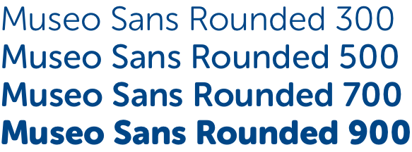

# Colours

## Use of colours

These colours form the core palette for all SSE digital products. Where appropriate, examples of usage are given but these are not absolute – refer to any supplied Sketch files or Zeplin links for specific usage.


Colours are referred to throughout these digital guidelines using their 'variable name' shown in the colour tables below.


## Primary Colours

SSE's primary brand colors used in all digital products. The primary colours are [WCAG AA compliant](https://www.w3.org/TR/WCAG20/#visual-audio-contrast) when contrasted with white \(\#fff\) **only**.

| **Colour** | **Variable name** | **Example usage** | **Hex code** |
| --- | --- | --- |
|  | $primaryBlue | Headings, labels, titles | `#004687` |
|  | $primaryGreen | Icons, bullet points, highlights | `#469638` |

