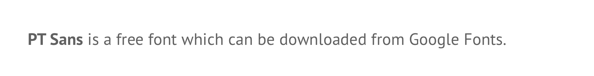
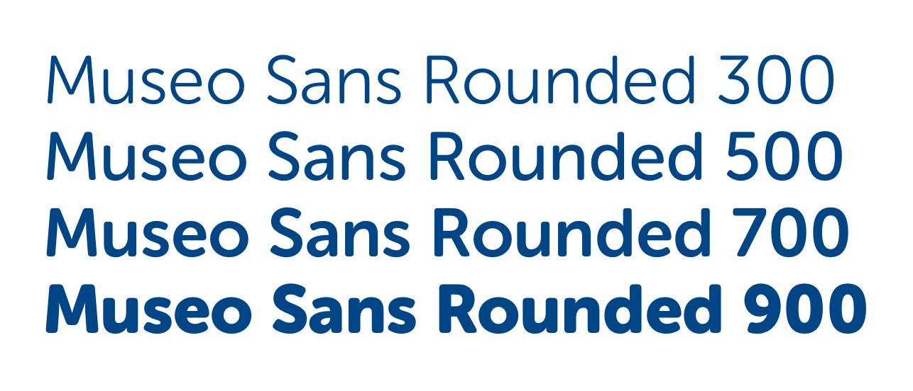

# Typography

## General guidelines

* Never end a header or label with a full stop \(.\)
* Only use a full stop for sentences, paragraphs and main body copy.
* Where possible, use [sentence case ↗](https://en.wikipedia.org/wiki/Letter_case#Sentence_case) for titles, labels & headings. It's more conversational & approachable and reflects how humans communicate with each other – we don’t use title case for texts, emails or letters.
* Avoid use of all caps wherever possible. Exceptions can be made for buttons.

## Fonts

SSE Digital products use Museo Sans Rounded and PT Sans.

### Museo Sans Rounded

Used for headings, sub-headings and buttons. This is a commercial font which cannot be downloaded for free. If you need Museo installed on your machine, speak to a member of the UX team.


### PT Sans

Used for body copy, captions etc. This is a free font which can be downloaded from Google Fonts.




## Heading styles

### Page heading \(H1\)



```css
font-face: Museo Sans Rounded;
font-weight: 300;
font-size: 48px;
line-height: 54px;
color: $primaryBlue;
```

### Section heading \(H2\)

```css
font-face: Museo Sans Rounded;
font-weight: 500;
font-size: 32px;
line-height: 38px;
color: $primaryBlue;
```

