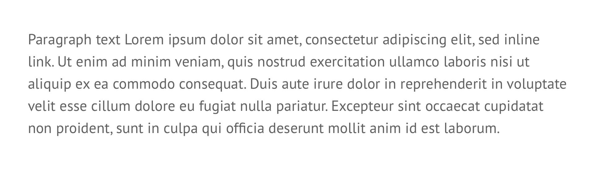

# Body copy


**Note:** All CSS shown is for basic styling purposes. The intention is not to represent publishable code but to help designers & developers foster a common understanding of the specifications.


## Body copy

Primary style for all body copy and form inputs.



```css
font-face: PT Sans;
font-size: 16px;
line-height: 24px;
color: $secondaryMidGrey or white;
```


