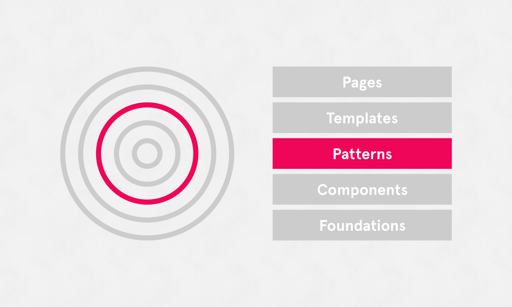

# Patterns

Referring to recurring or ever-present elements or practices throughout a product. A few examples include navigation, cards, empty or loading states, notifications, and modals. Documenting a pattern library helps us to identify these elements in an effort to establish and maintain consistency in our product's structure, user experience and design.

Patterns are built using the system components and foundations.

