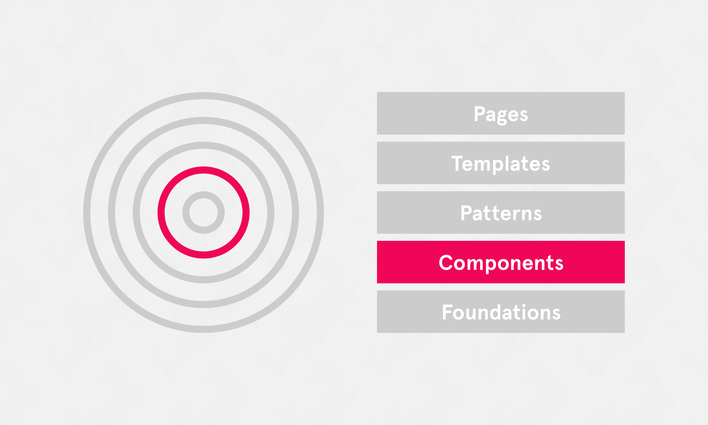

# Components

Referring to distinctive UI elements that are used over and over throughout the UI. A few examples include buttons, form inputs, toggles and tooltips. Another way of looking at it: A component is a UI element that you could 'drag & drop' into an artboard/canvas to make up the UI. Consistent UI components make a huge difference in guiding a user through a product, smoothly and efficiently.

