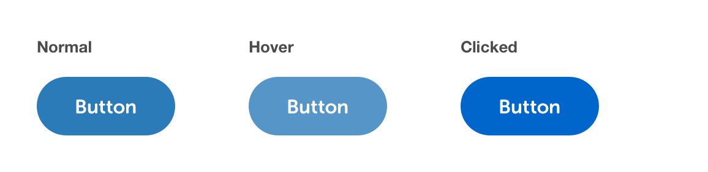

# Button types


**Note:** All CSS shown is for basic styling purposes. The intention is not to represent publishable code but to help designers & developers foster a common understanding of the specifications.


## Primary Button

* These are action oriented buttons. Think: 'Done', 'Save', 'Next', 'Submit' and are normally the primary positive action in any scenario.
* Some scenarios are more suited to the Secondary button style as the primary positive action, when the action doesn't need to be so prominent.
* Ideally there should only be one Primary button on any screen/scenario \(the core action to proceed/progress/take action on the page\). If there isn’t any one clear primary action, then consider using one or a combination of the other button styles.
* Can be used in isolation or in conjunction with other buttons.



```css
/* Normal */
font-face: Museo Sans Rounded;
font-weight: 700;
font-size: 16px;
line-height: 24px;
background-color: #2B7BB9;
color: #FFF;

/* Hover */
background-color: rgba(43,123,185,.8);

/* Clicked */
background-color: #0066CC;
```

## Secondary Button

* Similar to the Primary button, but intended to play a more supportive or less important action button role. Consider using the Secondary button style for things like ‘Edit’ buttons. The philosophy being, 'Edit' is a positive action, but not the definitive action, which would be saving the edit you made in the next step, therefor a Secondary action is more appropriate, and reserve a Primary action for the 'Save' or 'Done' step.
* Well suited to situations where there are multiple call to actions present \(e.g. when there are a multiple buttons, all with equal weighting\). In this case you could pair a Secondary button with a Primary button.
* Can be used in isolation or in conjunction with a Primary, or Link style button.


```css
/* Normal */
font-face: Museo Sans Rounded;
font-weight: 700;
font-size: 16px;
line-height: 24px;
background-color: #fff;
color: #2B7BB9;
border: 2px solid #2B7BB9;

/* Hover */
background-color: rgba(255,255,255,.8);

/* Clicked */
background-color: #F5F5F5;
```

```markup
jguguhg
```


