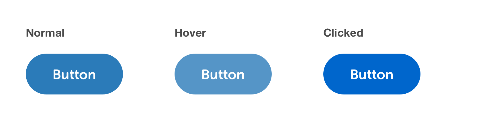

# Buttons


Note: All CSS shown is for guiding purposes, it's not absolute. It's intended to help designers foster a greater understanding of both CSS and the specifications.


## Labels

Button labels should always be descriptive, action-orientated and short. Try to use a maximum of 2-3 words to convey what a button does.

Button labels are always **Sentence case**.

## Spacing & Padding

* Large buttons have left/right padding of 32px.
* Buttons contained in narrow spaces \(e.g. filters\) should fill 100% of the width available to them. This helps with cleaner alignment with other elements in that column, and also aligns multiple buttons when stacked.
* If multiple buttons are horizontally aligned, there should be a 25px margin separating them.
* If multiple buttons are stacked vertically, there should be a 16px margin separating them.


## Primary Button

Primary buttons start, continue, progress or complete a process. On any given page, the primary button should indicate to the user what we expect them to want to do, usually a 'positive' action. Typically, there should only ever be one primary button on a single page.




### Normal State

```css
font-face: Museo Sans Rounded;
font-weight: 700;
font-size: 16px;
line-height: 24px;
background-color: #2B7BB9;
color: #FFF;
```

### Hover State

Styling is as 'normal state' with the following overrides:

```css
background-color: rgba(43,123,185,.8);
```

### Clicked State

Styling is as 'normal state' with the following overrides:

```css
background-color: #0066CC;
```

## Secondary Button

Secondary buttons are used in conjunction with primary buttons to indicate other areas of functionality. They are also used to go back or indicate a 'negative' action. Multiple secondary buttons can exist on a single page.


### Normal State

```css
font-face: Museo Sans Rounded;
font-weight: 700;
font-size: 16px;
line-height: 24px;
background-color: #fff;
color: #2B7BB9;
border: 2px solid #2B7BB9;
```

### Hover State

Styling is as 'normal state' with the following overrides:

```css
background-color: rgba(255,255,255,.8);
```

### Clicked State

Styling is as 'normal state' with the following overrides:

```css
background-color: #F5F5F5;
```

